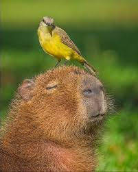

# Introduction
Hi! I'm Goh Haw Yee, a student in the Software Maintenance and Evolution course.

I expect to learn a lot about modern software maintenance practices and how to work with legacy systems.

- **Fun fact**: I love classical music and listen to it often when I work
- **Course expectations**: To learn more about maintaining software and evolving legacy systems.

**Languages** \
     

